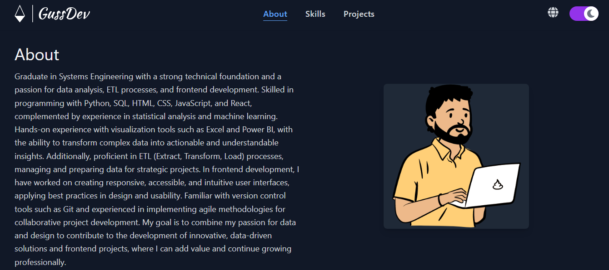

---
# **Web Portfolio - GussDev**

Portfolio web desarrollado en React con Vite, Tailwind CSS, y otras herramientas modernas. Este proyecto muestra habilidades en desarrollo frontend, análisis de datos, y visualización, destacando proyectos y experiencias relevantes.
---

## **Características**

- Diseño moderno y responsivo.
- Carrusel interactivo de perfiles.
- Paginación y filtros dinámicos para los proyectos.
- Optimizado para SEO y redes sociales.
- Desplegable como Progressive Web App (PWA).

---

## **Instalación**

### **Requisitos previos**

1. **Node.js**: Asegúrate de tener [Node.js](https://nodejs.org/) instalado (versión 16 o superior recomendada).
2. **npm** o **yarn**: Gestor de paquetes (instalado junto con Node.js).

### **Pasos para instalar**

1. Clona este repositorio:

   ```bash
   git clone https://github.com/gustavopumachagua/professional_website.git

   cd professional_website.git
   ```

2. Instala las dependencias necesarias:

   ```bash
   npm install
   ```

---

## **Ejecución del Proyecto**

### **Modo Desarrollo**

Para ejecutar el proyecto en modo desarrollo (con recarga en caliente):

```bash
npm run dev
```

Accede a la aplicación en [http://localhost:5173](http://localhost:5173).

### **Construir para Producción**

Para construir el proyecto optimizado para producción:

```bash
npm run build
```

Esto generará los archivos en la carpeta `dist/`.

### **Previsualizar Producción**

Para previsualizar la versión de producción:

```bash
npm run preview
```

---

## **Librerías Instaladas**

### **Dependencias principales**

1. **[react](https://reactjs.org/):** Biblioteca para construir interfaces de usuario.

   ```bash
   npm install react
   ```

2. **[react-dom](https://reactjs.org/docs/react-dom.html):** Renderiza componentes React en el DOM.

   ```bash
   npm install react-dom
   ```

3. **[react-icons](https://react-icons.github.io/react-icons/):** Conjunto de íconos listos para usar.

   ```bash
   npm install react-icons
   ```

4. **[prop-types](https://github.com/facebook/prop-types):** Validación de propiedades para componentes React.
   ```bash
   npm install prop-types
   ```

### **Dependencias de desarrollo**

1. **[vite](https://vitejs.dev/):** Herramienta rápida para desarrollo frontend.

   ```bash
   npm install --save-dev vite
   ```

2. **[@vitejs/plugin-react-swc](https://vitejs.dev/plugins/):** Soporte para React con el compilador SWC.

   ```bash
   npm install --save-dev @vitejs/plugin-react-swc
   ```

3. **[tailwindcss](https://tailwindcss.com/):** Framework CSS utilitario.

   ```bash
   npm install --save-dev tailwindcss postcss autoprefixer
   ```

4. **[eslint](https://eslint.org/):** Herramienta para mantener un código limpio y consistente.

   ```bash
   npm install --save-dev eslint
   ```

5. **[vite-plugin-pwa](https://vite-pwa-org.netlify.app/):** Agregar capacidades PWA al proyecto.

   ```bash
   npm install --save-dev vite-plugin-pwa
   ```

6. **[postcss](https://postcss.org/):** Herramienta para transformar CSS.

   ```bash
   npm install --save-dev postcss
   ```

7. **[autoprefixer](https://github.com/postcss/autoprefixer):** Añade prefijos CSS automáticamente.

   ```bash
   npm install --save-dev autoprefixer
   ```

8. **[@types/react](https://www.npmjs.com/package/@types/react) y [@types/react-dom](https://www.npmjs.com/package/@types/react-dom):** Definiciones de tipos para React y React DOM.

   ```bash
   npm install --save-dev @types/react @types/react-dom
   ```

9. **[eslint-plugin-react](https://github.com/jsx-eslint/eslint-plugin-react):** Reglas específicas de ESLint para React.
   ```bash
   npm install --save-dev eslint-plugin-react
   ```

---

## **SEO y Metadatos**

Este proyecto incluye optimización básica para motores de búsqueda (SEO) y redes sociales:

- **Meta etiquetas**: Título, descripción, palabras clave.
- **Open Graph**: Optimización para compartir en redes sociales.
- **Twitter Card**: Tarjetas optimizadas para Twitter.

---

## **Despliegue**

El proyecto está diseñado para desplegarse fácilmente en plataformas como [Vercel](https://vercel.com/).

### Pasos para desplegar:

1. Configura una cuenta en Vercel.
2. Conecta tu repositorio desde GitHub.
3. Configura el comando de construcción en Vercel:

   ```bash
   npm run build
   ```

4. Configura el directorio de salida como `dist/`.
5. Haz clic en "Deploy" y accede al enlace generado.

---

## **Estructura del Proyecto**

```plaintext
src/
├── assets/             # Imágenes, íconos y otros archivos estáticos
├── components/         # Componentes React reutilizables
├── data/               # Datos JSON para el contenido dinámico
├── pages/              # Componentes de páginas principales
├── styles/             # Archivos CSS o configuraciones de Tailwind
├── utils/              # Funciones de utilidad y validaciones
└── main.jsx            # Punto de entrada de la aplicación
```

---

## **Capturas**



---

## **Contribuciones**

¡Las contribuciones son bienvenidas! Si encuentras algún problema o tienes ideas para mejorar el proyecto, no dudes en abrir un **issue** o enviar un **pull request**.

---

## **Licencia**

Este proyecto está bajo la [Licencia MIT](./LICENSE).

---
